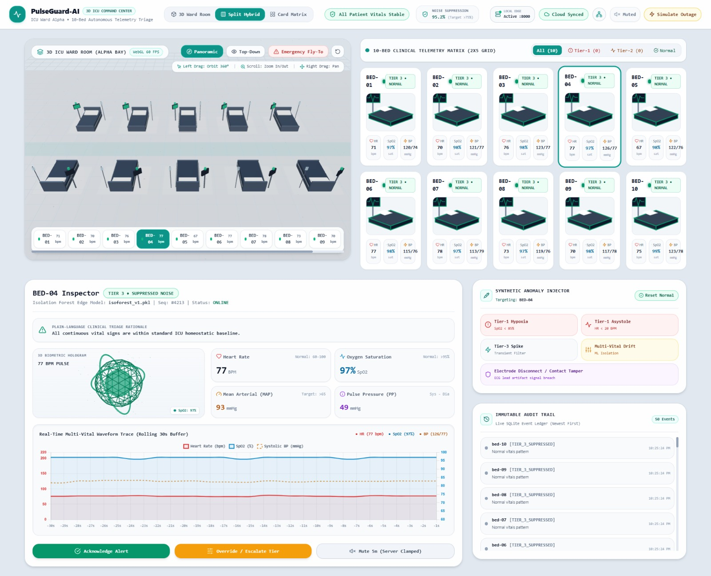
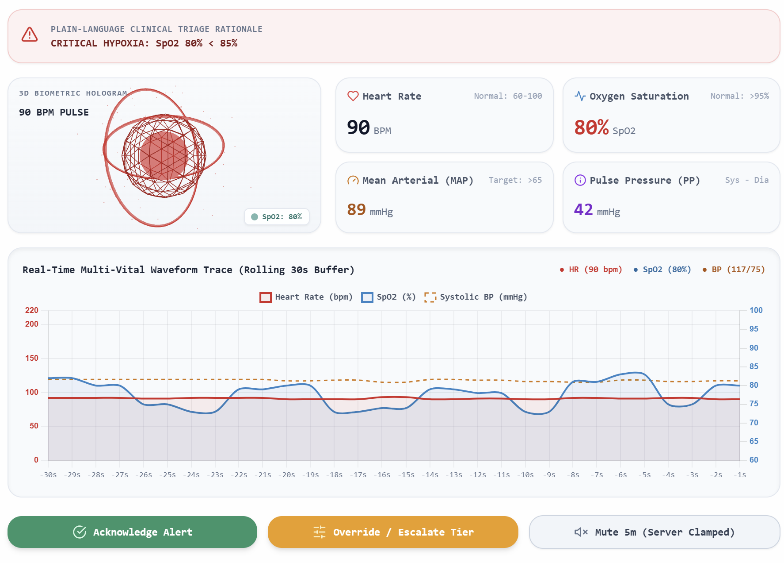
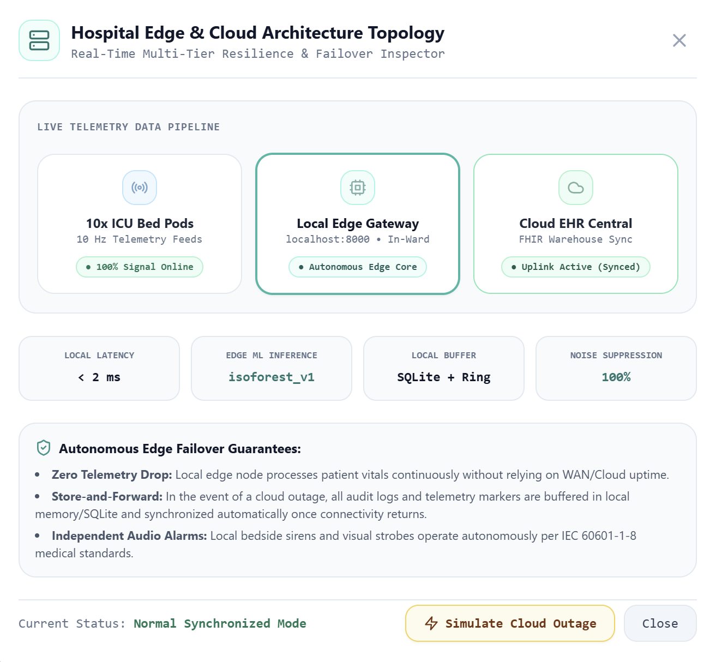

# PulseGuard-AI

**Autonomous Edge-AI Zero-Trust Triage & Resilience Gateway for Critical Care IoT**

A 10-bed ICU monitoring prototype that filters out non-actionable alarm noise using multi-vital anomaly scoring, and keeps triaging safely even with **zero cloud connectivity**.

> ⚠️ **This is a Hackathon Prototype — Not a Final Product**  
> Built in 36 hours as a ~10% proof-of-concept slice of the full PulseGuard-AI vision, per hackathon scope rules. It exists to demonstrate the core architecture and alarm-tiering logic, not to ship as-is. Not a diagnostic device, not clinically validated, not tested with real patients, and not production-hardened.

---

## The Problem

- **72–99%** of ICU alarms are non-actionable false alarms (NIH/AACN).
- Alarm fatigue is on ECRI's **Top 10 Health Technology Hazards** list.
- Cloud-first monitoring platforms go dark during network outages or cyber incidents — exactly when reliability matters most.

## What This Prototype Demonstrates

- Ingests simulated ECG, SpO₂, and BP telemetry for 10 ICU beds.
- Routes every event through a **3-tier alarm cascade** so only real events reach a nurse.
- Live React dashboard with a false-alarm suppression counter.
- **100% of the alarm path runs on local edge hardware** — cloud is used only for async reporting.

## Scope

**In scope:** real-time triage for 10 simulated beds, hard-threshold + ML alarm cascade, fully local alarm path, dashboard, audit trail.

**Out of scope:** FDA/IEC 62304 clearance, real patient data (all telemetry is synthetic), production auth/SSO, multi-ward scaling, a clinically-validated model. The edge gateway is a known single point of failure — acknowledged, not solved (Phase 2).

## Architecture

```
ICU Monitors (sim) --MQTT/JSON--> Edge Gateway (FastAPI) --WebSocket--> React Dashboard
                                        |-- Redis (sliding window)
                                        |-- PostgreSQL (audit log)
                                        \-- Cloud sync (async, non-blocking)
```

**Stack:** FastAPI · Redis 7.x · scikit-learn (Isolation Forest) · React + Chart.js · PostgreSQL · Docker Compose

## Alarm Cascade

| Tier | Trigger | Action |
|---|---|---|
| 1 — Critical | Hard threshold (SpO₂ < 85%) **OR** ML > 0.9 | Unsuppressable siren |
| 2 — Warning | 2+ vitals drifting, ML 0.5–0.9 | Nurse escalation |
| 3 — Transient | Single brief spike, ML < 0.5 | Suppressed, logged only |

Hard thresholds and ML run in parallel and are **OR'd** — the model can never suppress a hard-threshold breach.

## Demo Preview

<p align="center">
  
  
  
</p>

## Run Locally

### ⚡ 1-Click Unified Launch (Recommended for Any System)

Clone the repository and run the automated launcher for your operating system:

```bash
git clone https://github.com/<your-org>/pulseguard-ai.git
cd pulseguard-ai
```

#### 🪟 Windows
Simply **double-click** `start.bat` or run:
```cmd
.\start.bat
```
*(Or in PowerShell: `.\start.ps1`)*

#### 🐍 Any OS (Cross-Platform Python)
```bash
python run.py
```

#### 🍎 macOS / 🐧 Linux
```bash
chmod +x start.sh
./start.sh
```

> **What the launcher handles automatically:**
> - Checks Python (3.10+) and Node.js (18+) dependencies.
> - Automatically runs `npm install` on first launch.
> - Auto-cleans ports `8000` (FastAPI) and `3000` (Vite) to prevent port conflicts.
> - Discovers and displays your local WiFi/LAN IP for mobile & teammate testing.
> - Simultaneously starts both backend and frontend servers with unified color-coded logs.
> - Automatically opens **http://localhost:3000** in your default browser.

---

### 🛑 How to Stop Servers & Free Ports

- In terminal: Press `Ctrl + C`.
- On Windows: Double-click `stop.bat` to instantly terminate all servers and release ports `8000` and `3000`.
- On macOS/Linux: Run `./stop.sh`.

---

### 🛠️ Manual Terminal Run (Optional)

If you prefer running backend and frontend in separate terminal windows:

**Terminal 1: Backend (FastAPI)**
```bash
cd backend
python -m pip install -r requirements.txt
python -m uvicorn app.main:app --host 0.0.0.0 --port 8000 --reload
```

**Terminal 2: Frontend (Vite + React)**
```bash
cd frontend
npm install
npm run dev
```

---

### 🐳 Docker Compose (Optional)

To spin up the containerized stack (PostgreSQL, Redis, Gateway, Frontend):

```bash
docker-compose up --build -d
docker-compose ps
```

To stop all containers:
```bash
docker-compose down
```

---

## Disclaimer

This repo is a **hackathon proof-of-concept**, not a finished or deployable product. It's meant to prove the edge-triage architecture works end-to-end — the full vision (see [Scope](#scope)) is intentionally out of reach for a 36-hour build.

## Team

**F_society** — Parth, Sarvesh, Wasim, Mayuresh, Nishant

## License

Hackathon evaluation build. License TBD.
